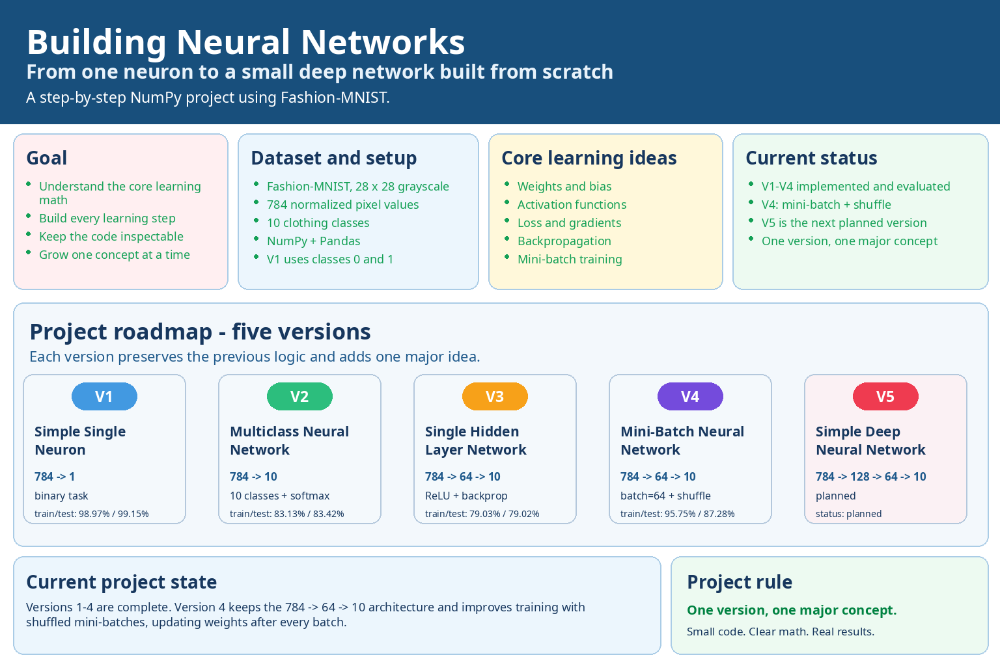

# Building Neural Networks

Build neural networks from scratch, step by step, to understand how forward propagation, loss functions, gradient descent, backpropagation, mini-batch training, and deeper architectures work under the hood.

The project uses the **Fashion-MNIST** dataset and progressively evolves from a single neuron for binary classification to a simple deep neural network, using only **NumPy, Pandas, and Matplotlib**. No TensorFlow, PyTorch, or scikit-learn models are used.



## Project goal

The goal is not to build the most accurate Fashion-MNIST classifier, but to make the core mechanics of neural networks explicit and understandable.

Each version introduces one major concept while preserving the logic developed in the previous stage:

1. binary classification with a single neuron
2. multiclass classification with softmax
3. a hidden layer, ReLU, and backpropagation
4. mini-batch gradient descent
5. a deeper network with two hidden layers

## Project structure

```text
Building Neural Networks/
├── infographic.png
├── project-report-en.pdf
├── project-report-it.pdf
├── v1-simple-single-neuron/
│   ├── building-neural-networks.ipynb
│   ├── Version 1.png
│   ├── Report Version 1 - Simple Single Neuron.pdf
│   └── Relazione Versione 1 - Neurone Singolo Semplice.pdf
├── v2-multiclass-neural-network/
│   ├── building-neural-networks.ipynb
│   ├── Version 2.png
│   ├── Report Version 2 - Multiclass Neural Network.pdf
│   └── Relazione Versione 2 - Rete Neurale Multiclasse.pdf
├── v3-single-hidden-layer-network/
│   ├── building-neural-networks.ipynb
│   ├── Version 3.png
│   ├── Report Version 3 - Single Hidden Layer Network.pdf
│   └── Relazione Versione 3 - Rete con un Layer Nascosto.pdf
├── v4-mini-batch-neural-network/
│   ├── building-neural-networks.ipynb
│   ├── Version 4.png
│   ├── Report Version 4 - Mini-Batch Neural Network.pdf
│   └── Relazione Versione 4 - Rete Neurale Mini-Batch.pdf
└── v5-simple-deep-neural-network/
    ├── building-neural-networks.ipynb
    ├── Version 5.png
    ├── Report Version 5 - Simple Deep Neural Network.pdf
    └── Relazione Versione 5 - Rete Neurale Profonda Semplice.pdf
```

## Version 1: Simple Single Neuron

The first version reduces Fashion-MNIST to a binary classification problem using only:

- `0` - T-shirt/top
- `1` - Trouser

Each 28×28 image is flattened into **784 input features** and normalized from `0-255` to `0-1`.

The model implements:

- one neuron
- weighted input `X @ w + b`
- sigmoid activation
- binary cross-entropy loss
- gradient descent
- a `0.5` classification threshold
- loss-based stopping with a tolerance

The weights and bias start at zero and are updated directly from the analytical gradients.

**Saved notebook results:**

- training loss: `0.0305`
- training accuracy: `98.97%`
- test accuracy: `99.15%`


## Version 2: Multiclass Neural Network

The second version extends the model to all **10 Fashion-MNIST classes**.

The single output neuron becomes a linear output layer with 10 neurons. The model introduces:

- one-hot encoded targets
- 10 output neurons
- numerically stable softmax
- multiclass cross-entropy
- full-batch gradient descent
- `argmax` class prediction

There are still no hidden layers, so the model remains a linear classifier in pixel space.

**Saved notebook results:**

- training loss: `0.5092`
- training accuracy: `83.13%`
- test accuracy: `83.42%`


## Version 3: Single Hidden Layer Network

The third version introduces the first non-linear hidden representation.

Architecture:

```text
784 inputs → 64 ReLU neurons → 10 softmax outputs
```

New concepts include:

- a 64-neuron hidden layer
- ReLU activation
- He-style random weight initialization
- forward propagation through multiple layers
- backpropagation through the output and hidden layers
- fixed-epoch training

The implementation explicitly computes every gradient needed to update both layers.

**Saved notebook results:**

- training loss: `0.5895`
- training accuracy: `79.03%`
- test accuracy: `79.02%`


## Version 4: Mini-Batch Neural Network

The fourth version keeps the same one-hidden-layer architecture but changes how the model is trained.

Architecture:

```text
784 inputs → 64 ReLU neurons → 10 softmax outputs
```

Training now introduces:

- random shuffling at the start of each epoch
- mini-batches of 64 samples
- forward propagation per mini-batch
- backpropagation per mini-batch
- parameter updates after every batch
- clipped probabilities inside the logarithm for numerical stability

This is a major practical step toward the training loop used by modern neural networks.

**Saved notebook results:**

- training loss: `0.0695`
- training accuracy: `95.75%`
- test accuracy: `87.28%`


## Version 5: Simple Deep Neural Network

The final version adds a second hidden layer and propagates gradients through the complete network.

Architecture:

```text
784 inputs → 128 ReLU neurons → 64 ReLU neurons → 10 softmax outputs
```

It combines the ideas developed in the earlier versions:

- normalized image inputs
- one-hot targets
- He-style initialization
- ReLU hidden activations
- softmax output probabilities
- multiclass cross-entropy
- mini-batch gradient descent
- data shuffling
- forward propagation through three parameterized layers
- backpropagation through both hidden layers

**Saved notebook results:**

- training loss: `0.0145`
- training accuracy: `99.59%`
- test accuracy: `89.92%`


## Results

| Version | Model | Train accuracy | Test accuracy |
|---|---|---:|---:|
| V1 | Single neuron, binary | 98.97% | 99.15% |
| V2 | Linear multiclass network | 83.13% | 83.42% |
| V3 | One hidden layer, full-batch | 79.03% | 79.02% |
| V4 | One hidden layer, mini-batch | 95.75% | 87.28% |
| V5 | Two hidden layers, mini-batch | 99.59% | 89.92% |

The V1 result is not directly comparable with V2-V5 because it uses only two Fashion-MNIST classes, while the remaining versions solve the full 10-class problem.

The project is intentionally educational rather than benchmark-oriented, so the architectures and hyperparameters are kept simple and the versions are designed primarily to expose one new concept at a time.

## Core concepts implemented from scratch

Across the five versions, the notebooks implement the central mechanics of a neural network directly with NumPy:

- weighted sums and biases
- sigmoid
- ReLU
- softmax
- binary cross-entropy
- multiclass cross-entropy
- one-hot encoding
- gradient descent
- analytical gradients
- backpropagation
- random initialization
- mini-batch training
- data shuffling
- multiclass prediction

## Dataset

The project uses the CSV version of **Fashion-MNIST** by Zalando Research.

Each sample is a 28×28 grayscale image represented by 784 pixel values and one class label from `0` to `9`.

The notebooks were written for the Kaggle dataset path:

```python
PATH = "/kaggle/input/datasets/zalando-research/fashionmnist/"
```

Expected files:

```text
fashion-mnist_train.csv
fashion-mnist_test.csv
```

If you run the notebooks locally, download the Fashion-MNIST CSV dataset and change `PATH` to the directory containing those files.

The dataset itself is not included in this repository.

## Requirements

The notebooks require Python 3 and the following libraries:

```text
numpy
pandas
matplotlib
jupyter
```

For example:

```bash
pip install numpy pandas matplotlib jupyter
```

## Running the project

Clone the repository and open Jupyter:

```bash
git clone <repository-url>
cd building-neural-networks
jupyter notebook
```

Then open any version's `building-neural-networks.ipynb` notebook.

The versions are self-contained, so they can be explored independently, although following them from V1 to V5 makes the progression easier to understand.

## Design choices and limitations

This project deliberately favors transparency over abstraction and performance.

- Neural-network layers are implemented directly with matrix operations rather than framework APIs.
- Training loops are intentionally explicit.
- Hyperparameters are manually selected rather than tuned systematically.
- There is no validation split or cross-validation.
- There is no regularization such as dropout or weight decay.
- There are no convolutional layers, even though Fashion-MNIST is an image dataset.
- There are no adaptive optimizers such as Adam or RMSprop.
- The models are not intended to compete with production-grade deep-learning frameworks.

These limitations keep the focus on understanding the mechanics that higher-level libraries normally hide.

## Reports

Each version includes an English and an Italian PDF report. The repository also contains two complete project reports:

- `project-report-en.pdf`
- `project-report-it.pdf`

## License

This project is distributed under the [MIT License](LICENSE).

## Author

Created by [Luca Lullo](https://github.com/lucalullo).
